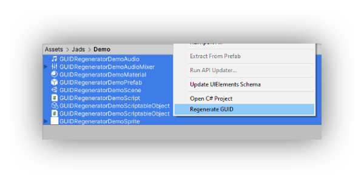

# :id: Unity GUID Regenerator

A Unity editor tool to regenerate GUID for your assets

> **Disclaimer**: Only use this if needed. Intentionally modifying the GUID of an asset is not recommended unless certain issues are encountered

## What is GUID in Unity?
GUID is a unique hash that is automatically generated and assigned when creating a new asset. This GUID is used when a serialized asset references another asset.

It is stored in an asset's meta file. Manually you can open and view a meta file in a text editor to get the GUID. However, Unity has its [AssetDatabase](https://docs.unity3d.com/ScriptReference/AssetDatabase.html) API that is useful for accessing and performing operations on assets.

## Why regenerate a GUID?
When you work on multiple projects that are based on existing projects, chances are most of the assets have the same GUID. This can cause some issues later on when you add more assets from existing projects. Unity won't be able to distinguish the difference between assets with same GUID even they have different file name and contents. This can cause Unity to associate references to the wrong asset.

The simplest workaround for this is to duplicate the asset. The newly created asset will have its own GUID assigned by Unity. However, you will need to manually replace all its references in the Scene, prefabs, etc.

## Usage

1. Select one or multiple assets (folders are not supported)
2. Right click > **Generate GUID**
3. A modal will show to warn and confirm the action. **Click Proceed**.
4. Wait for the operation to complete. *Note that this will take a long time on larger projects.*
5. A report will be logged in the console detailling what assets are updated/skipped.

## Notes
- Scenes are always skipped as this corrupts the scene.

## Author
- [Jeff Jadulco](https://github.com/jeffjads)

## License
This project is open source and available under the [MIT License](LICENSE).
